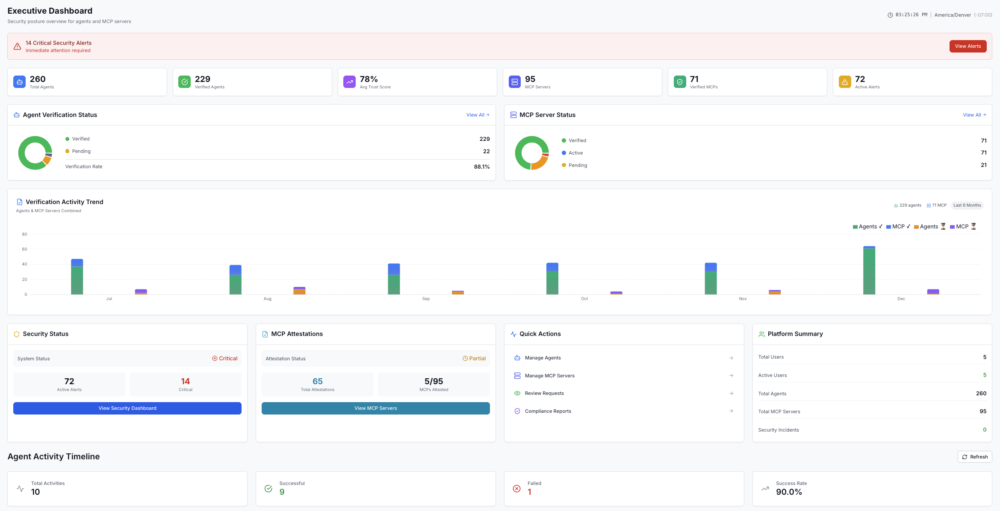
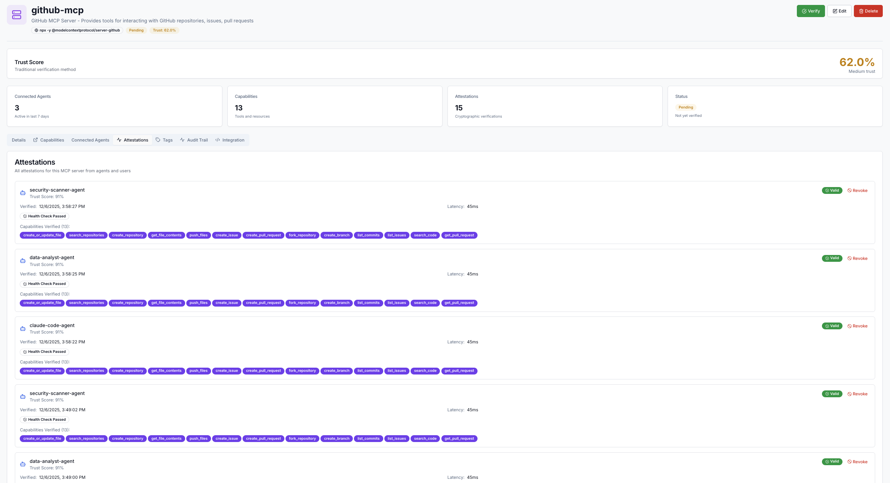
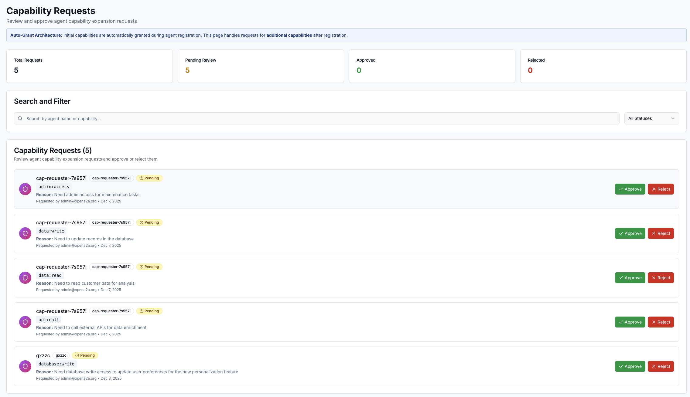
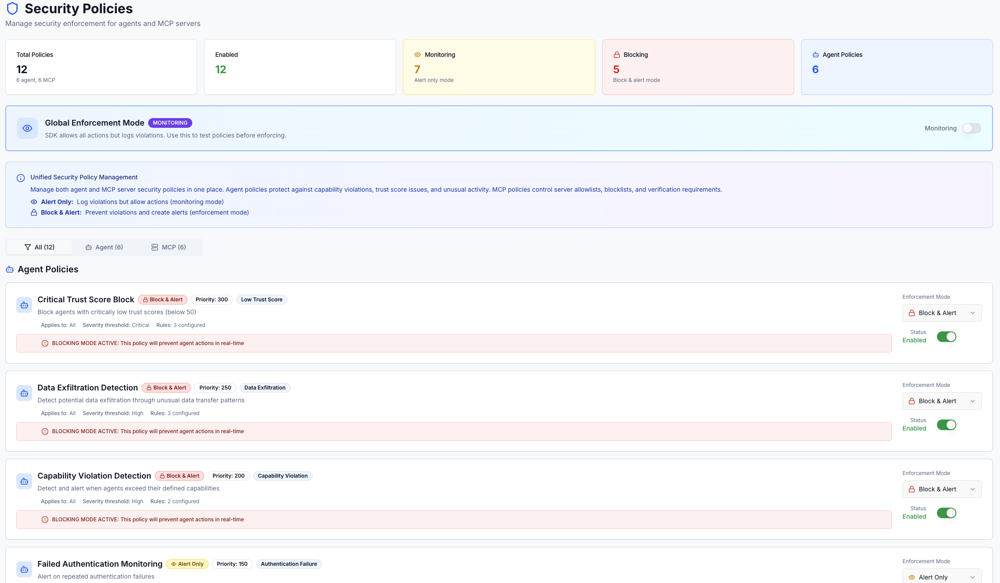

> **[OpenA2A](https://opena2a.org)**: [AIM](https://github.com/opena2a-org/agent-identity-management) · [HackMyAgent](https://github.com/opena2a-org/hackmyagent) · [OASB](https://github.com/opena2a-org/oasb) · [ARP](https://github.com/opena2a-org/arp) · [Secretless](https://github.com/opena2a-org/secretless-ai) · [DVAA](https://github.com/opena2a-org/damn-vulnerable-ai-agent)

<div align="center">

# Agent Identity Management (AIM)

**The open-source NHI platform for AI agents — cryptographic identity, governance, and access control by default.**

> Enterprises manage millions of non-human identities (NHI). AI agents are the fastest-growing — and least-governed — category. AIM fixes that.

[](https://github.com/opena2a-org/agent-identity-management/actions/workflows/security.yml)
[](https://github.com/opena2a-org/agent-identity-management/actions/workflows/ci.yml)
[](https://github.com/opena2a-org/agent-identity-management/pkgs/container/aim-server)
[](https://github.com/opena2a-org/agent-identity-management/actions/workflows/release.yml)
[](apps/backend)
[](LICENSE)
[](https://go.dev/)
[](https://python.org/)

[📺 Demo Video](https://youtu.be/meD_LW5fc_A) • [📚 Docs](https://opena2a.org/docs) • [💬 Discord](https://discord.gg/uRZa3KXgEn)

</div>

---

## Quick Start

```bash
curl -sSL https://raw.githubusercontent.com/opena2a-org/agent-identity-management/main/scripts/quickstart.sh | bash
```

That's it. Opens dashboard at [localhost:3000](http://localhost:3000), API at [localhost:8080](http://localhost:8080). Secrets are auto-generated. Login credentials are printed at the end — change the password on first login.

**Or use AIM Cloud:** [aim.opena2a.org](https://aim.opena2a.org) — no infrastructure required.

<details>
<summary><strong>Build from source instead</strong></summary>

```bash
git clone https://github.com/opena2a-org/agent-identity-management.git
cd agent-identity-management
docker compose build && docker compose up -d
```

</details>

### Docker Images

| Image | Description |
|-------|-------------|
| `ghcr.io/opena2a-org/aim-server` | Backend API server |
| `ghcr.io/opena2a-org/aim-dashboard` | Web dashboard |

| Tag | Description |
|-----|-------------|
| `latest` | Latest stable release |
| `edge` | Built from `main` on every push |
| `1.22.0` | Specific release version |
| `1.22` | Latest patch in the 1.22 series |
| `1` | Latest minor in the 1.x series |

### Verify Image Signatures

```bash
cosign verify ghcr.io/opena2a-org/aim-server:latest \
  --certificate-identity-regexp="https://github.com/opena2a-org/agent-identity-management" \
  --certificate-oidc-issuer="https://token.actions.githubusercontent.com"
```

---

## Secure Your Agent (One Line)

```python
from aim_sdk import secure

agent = secure("my-assistant", capabilities=["db:read", "api:call"])

@agent.perform_action(capability="db:read")
def get_customer(id):
    return db.query(id)
```

That's it. Your agent now has:
- Cryptographic identity (Ed25519)
- Capability enforcement
- Full audit trail
- Real-time monitoring

---

## What AIM Solves

| Problem | Without AIM | With AIM |
|---------|-------------|----------|
| Agent impersonation | Anyone can claim to be your agent | Cryptographic proof required |
| Prompt injection | Agent tricked into unauthorized actions | Capability enforcement blocks it |
| No visibility | What are your agents doing? | Complete audit trail |
| MCP supply chain | Unknown servers, no verification | MCP attestation + drift detection |
| NHI governance gap | No inventory, no ownership, no lifecycle for agent identities | Full NHI governance — ownership, lifecycle automation, compliance reporting |

---

## Features

<details>
<summary><strong>Dashboard & Monitoring</strong></summary>

Real-time visibility into your AI agent fleet:

- **Trust Scoring** — 8-factor algorithm evaluates agent trustworthiness
- **Security Alerts** — Severity-based alerts with acknowledgment workflow
- **Activity Timeline** — Every action, verification, and MCP connection
- **Compliance Checks** — 10 automated checks for security compliance



</details>

<details>
<summary><strong>MCP Server Attestation</strong></summary>

Verify and monitor Model Context Protocol servers:

- **Auto-Attestation** — SDK automatically attests MCP servers on first use
- **Drift Detection** — Alerts when server tools change unexpectedly
- **Supply Chain View** — See all MCP servers across your organization



</details>

<details>
<summary><strong>Capability-Based Access Control</strong></summary>

Define what each agent can do. Block everything else.

- **Declared Capabilities** — `db:read`, `api:call`, `file:write`, etc.
- **Runtime Enforcement** — Unauthorized actions blocked at API layer
- **Risk Level Detection** — Automatic risk assessment from patterns

</details>

<details>
<summary><strong>Just-In-Time Access</strong></summary>

Sensitive operations require admin approval:

- **Request Workflow** — Agents request elevated access
- **Time-Limited** — Access expires automatically
- **Full Audit Trail** — Every request logged



</details>

<details>
<summary><strong>Security Policies</strong></summary>

- **MONITORING Mode** — Observe and alert without blocking (development)
- **STRICT Mode** — Enforce policies and block violations (production)
- **Data Exfiltration Detection** — Detect unusual data transfer patterns



</details>

<details>
<summary><strong>NHI Governance</strong></summary>

Manage AI agents as first-class non-human identities:

- **Ownership Attribution** — Every agent linked to a human owner and team
- **Lifecycle Management** — Active, inactive, suspended, revoked states with automated transitions
- **Shadow Agent Discovery** — Find unregistered agents across your environment
- **Orphan Detection** — Alert when agent owners leave the organization
- **ABOM Generation** — Agent Bill of Materials for compliance (CycloneDX export)
- **Compliance Reports** — NHI inventory exports for SOC 2, HIPAA, GDPR, ISO 27001

</details>

---

## SDKs

| SDK | Install | Status |
|-----|---------|--------|
| **Python** | `pip install aim-sdk` | ✅ Stable |
| **Java** | Maven/Gradle | ✅ Stable |
| **TypeScript** | Coming soon | 🚧 In progress |

### Python Example

```python
from aim_sdk import secure, AgentType

agent = secure(
    "my-agent",
    agent_type=AgentType.LANGCHAIN,
    capabilities=["db:read", "api:call"],
    tags=["production"],
    metadata={"model": "gpt-4"}
)

@agent.perform_action(capability="db:read")
def query_users():
    return database.get_users()
```

### Java Example

```java
AIMClient agent = AIMClient.secure(
    "my-agent",
    Arrays.asList("db:read", "api:call"),
    AgentType.LANGCHAIN
);

User user = agent.performAction("db:read", "users", () -> {
    return userRepository.findById(userId);
});
```

---

## Architecture

AIM uses **direct observation** — not proxies. Unlike traditional NHI platforms that discover service accounts through API integrations, AIM governs AI agents natively. Agents report actions explicitly via SDK decorators while communicating directly with target systems.

```
┌─────────────────────────────────────────────────────────────┐
│  YOUR AGENT                                                 │
│  ┌────────────────────────────────────────────────────────┐ │
│  │ @agent.perform_action(capability="db:read")            │ │
│  │ def get_data():                                        │ │
│  │     return database.query()  ─────────────────────────────► Target
│  └────────────────────────────────────────────────────────┘ │  (Direct)
│                    │                                        │
│                    │ Reports action                         │
│                    ▼                                        │
│              AIM Backend                                    │
│         (Verify + Log + Enforce)                            │
└─────────────────────────────────────────────────────────────┘
```

**Key points:**
- Zero latency added to agent↔target communication
- No single point of failure (fail-open mode available)
- Works with any MCP server, API, or database

---

## Deployment

```bash
# Development
docker compose up -d
```

See [infrastructure/DEPLOYMENT.md](infrastructure/DEPLOYMENT.md) for production deployment guides (AWS, Azure, GCP, Kubernetes).

---

## Documentation

- [SDK Quickstart](https://opena2a.org/docs/tutorials/sdk-quickstart) — Secure your first agent
- [MCP Registration](https://opena2a.org/docs/tutorials/mcp-registration) — Connect MCP servers
- [Post-Quantum Cryptography](docs/guides/PQC.md) — ML-DSA signatures
- [Full Documentation](https://opena2a.org/docs)

---

## Contributing

We welcome contributions! See [CONTRIBUTING.md](CONTRIBUTING.md).

---

## OpenA2A Ecosystem

| Project | Description | Install |
|---------|-------------|---------|
| [**AIM**](https://github.com/opena2a-org/agent-identity-management) | Agent Identity Management -- identity and access control for AI agents | `pip install aim-sdk` |
| [**HackMyAgent**](https://github.com/opena2a-org/hackmyagent) | Security scanner -- 147 checks, attack mode, auto-fix | `npx hackmyagent secure` |
| [**OASB**](https://github.com/opena2a-org/oasb) | Open Agent Security Benchmark -- 182 attack scenarios | `npm install @opena2a/oasb` |
| [**ARP**](https://github.com/opena2a-org/arp) | Agent Runtime Protection -- process, network, filesystem monitoring | `npm install @opena2a/arp` |
| [**Secretless AI**](https://github.com/opena2a-org/secretless-ai) | Keep credentials out of AI context windows | `npx secretless-ai init` |
| [**DVAA**](https://github.com/opena2a-org/damn-vulnerable-ai-agent) | Damn Vulnerable AI Agent -- security training and red-teaming | `docker pull opena2a/dvaa` |

---

## License

Apache-2.0 — See [LICENSE](LICENSE)

---

<div align="center">

⭐ **Star this repo** if AIM helps secure your AI agents!

</div>
