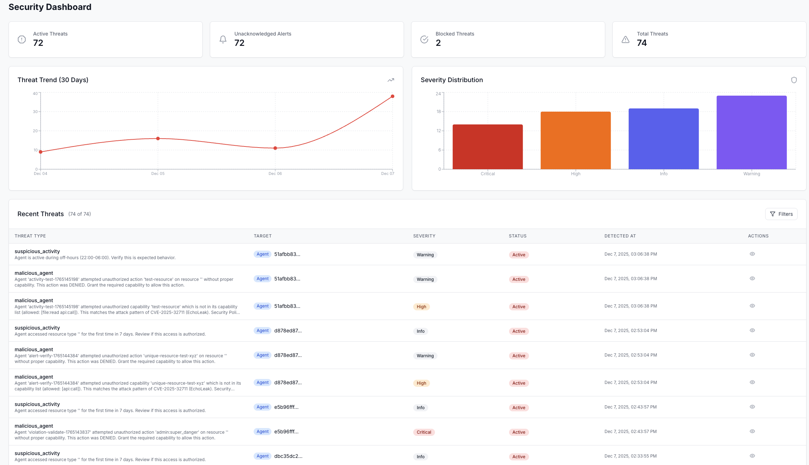
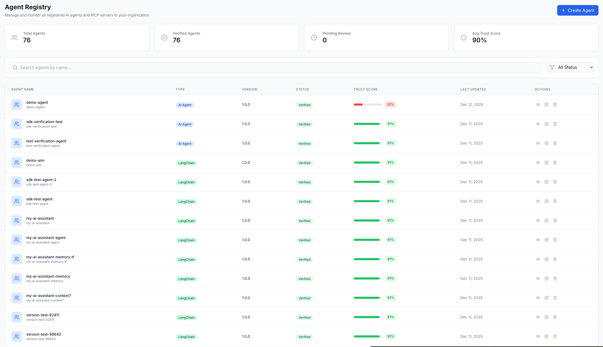
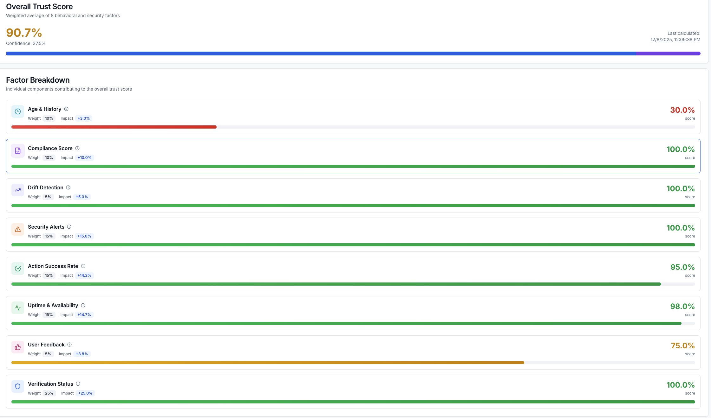

# Agent Identity Management (AIM)

[](./STATUS.md)

> **[OpenA2A](https://github.com/opena2a-org/opena2a)**: [CLI](https://github.com/opena2a-org/opena2a) · [HackMyAgent](https://github.com/opena2a-org/hackmyagent) · [Secretless](https://github.com/opena2a-org/secretless-ai) · [AIM](https://github.com/opena2a-org/agent-identity-management) · [Browser Guard](https://github.com/opena2a-org/AI-BrowserGuard) · [DVAA](https://github.com/opena2a-org/damn-vulnerable-ai-agent)

Cryptographic identity, capability authorization, and audit trails for AI agents. Apache 2.0.

[](https://github.com/opena2a-org/agent-identity-management/actions/workflows/ci.yml)
[](https://github.com/opena2a-org/agent-identity-management/actions/workflows/security.yml)
[](https://hub.docker.com/r/opena2a/aim-server)
[](LICENSE)

[Website](https://opena2a.org) · [Demos](https://opena2a.org/demos) · [Discord](https://discord.gg/uRZa3KXgEn)

> **AIM 1.0.** Every gate criterion in [HARDENING.md](HARDENING.md)'s "Roadmap to 1.0" is met as of 2026-05-28. Semver is honored from this release forward; security patches are triaged within 24 hours per [SECURITY.md](SECURITY.md). A paid third-party security review is appropriate when a regulated customer requires formal attestation but is not a binding gate (AIM is open source under Apache-2.0 and the codebase is publicly auditable).

## Quick start

Install the SDK and authenticate:

```bash
pip install aim-sdk
aim-sdk login                    # OAuth to aim.opena2a.org, or --url for self-hosted
```

Then protect any function with a capability grant:

```python
from aim_sdk import secure

agent = secure("my-first-agent")

@agent.perform_action(capability="db:read")
def get_customer(customer_id):
    return db.query("SELECT * FROM customers WHERE id = ?", customer_id)
```

`secure()` generates an Ed25519 keypair, registers the agent with the AIM backend, and stores credentials at `~/.aim/`. `@perform_action` signs every invocation, runs it through 5-step Fine-Grained Authorization, and records the outcome in the audit log.

New to AIM? The [SDK quickstart tutorial](https://opena2a.org/docs/tutorials/sdk-quickstart) walks through this end to end. The same one-line shape works in [Java](#java) and [TypeScript](#typescript).

Auditing an existing codebase instead of integrating? The [opena2a CLI](#operations-the-opena2a-cli) provides a 6-phase review with no server required.

## See it work

Same agent code, run twice. The injection lands on both. On the AIM-protected run, the outbound exfil is denied at the tool-call boundary because `http:post` is outside the agent's declared capability grant.


This is the [RAGBot-AIM A/B demo](https://github.com/opena2a-org/damn-vulnerable-ai-agent#aim-protected-agent) from [DVAA](https://github.com/opena2a-org/damn-vulnerable-ai-agent), the intentionally vulnerable agent platform. Break an agent there, then watch AIM stop the same attack — no server, no API key, no network; identity, capability policy, and audit log live on disk.

## Three deployment modes

| Mode | When | Includes |
|---|---|---|
| **AIM Cloud** | Managed, fastest path | Production-managed at [aim.opena2a.org/get-started](https://aim.opena2a.org/get-started). Python and Java SDKs work out of the box. |
| **Self-hosted** | Team or fleet, your infrastructure | All AIM Cloud features. PostgreSQL audit, REST API, dashboard, OAuth, 5-step FGA, 9-factor real-time trust, MCP attestation, PAM, SIEM adapters. |
| **Local-only** | Solo developer, single machine, no server | TypeScript SDK + opena2a CLI. Ed25519 keypair, `audit.jsonl`, YAML capability policies, 8-factor local trust score, cross-tool event bridges. Python and Java local mode is on the roadmap. |

All three share the same audit-event schema. Local agents can push history to a server via `AIMCore.enableReporting()`.

## SDKs

| SDK | Install | Mode | API |
|---|---|---|---|
| Python | `pip install aim-sdk` | Server (today) | `secure("name")` + `@perform_action` |
| Java | `org.opena2a:aim-sdk:1.0.0` | Server | `AIMClient.secure("name")` + `@SecureAction` |
| TypeScript | `npm install @opena2a/aim-core` | Local or server | `new AIMClient({ agentId })` |

Working examples for all three live in [`examples/`](examples/).

### Python

`secure()` auto-detects your framework from imports (`langchain`, `crewai`, `llama_index`, `anthropic`, `openai`). When both a framework and an LLM provider are present, the framework wins.

`@agent.perform_action` signs each invocation, runs it through 5-step FGA on the server, and records the outcome. Risk level auto-detects from the capability string using two lookup tables in [`sdk/python/aim_sdk/risk_detector.py`](sdk/python/aim_sdk/risk_detector.py):

- **Namespace prefix.** `payment:`, `admin:`, `system:`, `billing:`, `finance:` map to critical. `email:`, `notification:`, `sms:`, `user:`, `auth:`, `secret:`, `credential:` map to high. `db:`, `database:`, `file:`, `storage:`, `cache:` map to medium. `api:`, `weather:`, `search:`, `geocode:`, `translate:`, `time:`, `math:`, `util:` map to low.
- **Action suffix.** `:read`, `:fetch`, `:get`, `:list`, `:query`, `:view`, `:check`, `:validate` map to low. `:write`, `:update`, `:create`, `:modify`, `:save`, `:upload` map to medium. `:delete`, `:send`, `:execute`, `:run`, `:invoke`, `:export`, `:transfer` map to high. `:process`, `:refund`, `:charge`, `:approve`, `:drop`, `:truncate`, `:wipe`, `:terminate` map to critical.

When namespace and action disagree the higher risk wins. A `SPECIFIC_CAPABILITY_MAP` in the same file overrides both for known patterns (for example `user:delete` escalates to critical). Pass `risk_level="critical"` to override, and `jit_access=True` to pause execution until a human approves in the dashboard.

Full example: [`examples/flight-search-agent/flight_agent.py`](examples/flight-search-agent/flight_agent.py).

### Java

```java
AIMClient agent = AIMClient.secure("my-first-agent");

@SecureAction(capability = "db:read", resource = "users_table")
public User getCustomer(String customerId) {
    return userRepository.findById(customerId);
}
```

Production-ready at v1.0.0. Same Ed25519 signing, same FGA flow, same audit trail. AspectJ wraps `@SecureAction` invocations. See [`sdk/java/README.md`](sdk/java/README.md).

### TypeScript

```typescript
import { AIMClient } from "@opena2a/aim-core";

const agent = new AIMClient({ agentId: "my-first-agent" });
await agent.verify({ capability: "db:read", resource: "users_table" });
```

The only SDK that runs without a server today. Backs local mode. See [`sdk/typescript/README.md`](sdk/typescript/README.md).

## Server features

### 5-step Fine-Grained Authorization

Every privileged action runs through five checks before execution.

| Step | Check | Latency budget |
|---|---|---|
| 1 | Capability | <10ms |
| 2 | Attribute | <10ms |
| 3 | Context | <10ms |
| 4 | Chain | <10ms |
| 5 | Intent (NanoMind) | up to 800ms on HIGH-risk operations |

Step 5 uses the [NanoMind security classifier](https://huggingface.co/opena2a/nanomind-security-classifier), a 3M-parameter local Mamba model. No external calls.

### Trust-gated capabilities

9-factor real-time trust scoring runs on every action. Per-capability thresholds gate access.

### MCP attestation

Multi-agent consensus. 3+ attesters across 2+ owners equals verified.

### Privileged Access Management

Three tiers: STANDARD, PRIVILEGED, SUPER_PRIVILEGED. Human approval gates, break-glass override, and certification campaigns.

### CyberArk integration

CCP for vaulted credential retrieval. PSM for privileged session recording.

### SIEM adapters

Splunk HEC and Microsoft Sentinel Data Collector. Buffered batch delivery, retry, severity filtering.

### Web dashboard

Available in Self-hosted and AIM Cloud modes.


*Fleet overview: agents monitored, actions blocked, and risk by category.*


*Agent registry with trust scores and verification status per agent.*


*Per-agent 9-factor trust score breakdown with weighted signal contributions.*


*MCP server dependencies with multi-agent attestation status.*

## Operations: the opena2a CLI

The [opena2a CLI](https://github.com/opena2a-org/opena2a) is a separate tool for SecOps workflows: auditing a codebase, hardening configs on disk, monitoring runtime events. Not required to integrate the SDK.

```bash
opena2a review                  # 6-phase audit of a codebase
opena2a protect                 # migrate hardcoded credentials → env vars
opena2a guard sign              # filesystem integrity signing
opena2a runtime tail            # ARP event stream
opena2a identity audit          # cross-tool audit log
opena2a identity attach --all   # install cross-tool event bridges
```

Install:

```bash
brew install opena2a-org/tap/opena2a    # or
npm install -g opena2a-cli
```

`opena2a identity attach --all` installs bridges that read other OpenA2A tools' event logs and re-emit each event into one unified JSONL:

```text
Secretless events    ──┐
HMA scan findings    ──┤
HMA ARP runtime      ──┼─→ ~/.opena2a/aim-core/audit.jsonl
ConfigGuard events   ──┤
Shield events        ──┘
```

No decorator. No library import in agent code. Run `attach --all` once, work normally, and after an incident the audit log holds a deduplicated, timestamp-ordered trail of credential injections, file accesses, network calls, config tampering, and scan findings.

Capability authorization (deny-before-execute, FGA, intent classification) requires the server. See [Server features](#server-features).

## Install AIM (self-hosted)

### Docker

```bash
curl -sSLO https://raw.githubusercontent.com/opena2a-org/agent-identity-management/main/scripts/quickstart.sh
shasum -a 256 quickstart.sh     # verify against the SHA in the latest release notes
bash quickstart.sh
```

Brings up `aim-server`, `aim-dashboard`, PostgreSQL, and Redis. Dashboard at `localhost:3000`, API at `localhost:8080`. Login credentials print at the end of the run.

Production deployment (Azure, GCP, AWS): [infrastructure/DEPLOYMENT.md](infrastructure/DEPLOYMENT.md).

### From source

Prerequisites: Docker, Go 1.22+, Node 20+, Python 3.11+.

```bash
git clone https://github.com/opena2a-org/agent-identity-management.git
cd agent-identity-management

# Generate local-dev secrets (one-time setup)
./scripts/gen-dev-secrets.sh > .env

# Minimal dev stack
docker compose up -d aim-postgres aim-redis aim-backend aim-frontend

# Health check
curl -fsS localhost:8080/healthz

# Python SDK editable for examples
pip install -e sdk/python

# Try the flight-search-agent demo
cd examples/flight-search-agent && python3 flight_agent.py
```

The full `docker-compose.yml` also brings up Elasticsearch, MinIO, NATS, Prometheus, Grafana, and Loki. Skip those services with the minimal command above.

### Verifying what was installed

Every release publishes via npm Trusted Publishing with SLSA v1 provenance. No long-lived `NPM_TOKEN`. GitHub Actions exchanges its OIDC token with npm at publish time.

```bash
npm view @opena2a/aim-core dist.attestations --json
# Expects non-empty result with predicateType "https://slsa.dev/provenance/v1"
```

Identity files (`~/.opena2a/aim-core/identity.json`) are written `mode 0600`. OAuth tokens live in the OS keychain by default. `~/.opena2a/auth.json` stores metadata only.

## Trust scoring

The local and server trust scores measure different things.

**Local (8 factors)** answers "is the agent's security posture set up correctly?" Computed from local files. Source: [`packages/aim-core/src/trust.ts`](https://github.com/opena2a-org/opena2a/blob/main/packages/aim-core/src/trust.ts).

| Factor | Weight | Signal |
|---|---|---|
| Identity | 20% | `identity.json` exists |
| Capabilities | 15% | `policy.yaml` exists |
| Audit log | 10% | `audit.jsonl` exists |
| Secrets managed | 15% | Secretless integration active |
| Config signed | 10% | ConfigGuard signatures present |
| Skills verified | 10% | HMA verification on skills |
| Network controlled | 10% | Egress policy detected |
| Heartbeat monitored | 10% | ARP runtime heartbeat present |

**Server (9 factors)** answers "is the agent behaving in a way that should still be trusted right now?" Updates on every action. Source: [`apps/backend/internal/domain/trust_score.go`](apps/backend/internal/domain/trust_score.go).

| Factor | Weight | Source |
|---|---|---|
| Verification status | 25% | Externally attested |
| Uptime | 15% | Observed |
| Action success rate | 15% | Observed |
| Security alerts | 15% | NanoMind-modulated |
| Compliance | 10% | Externally attested |
| Execution isolation | 10% | Externally attested |
| Agent age | 5% | Server-recorded |
| Drift detection | 3% | Observed |
| User feedback | 2% | Human input |

Both can run for the same agent when local-to-server reporting is enabled.

## Observability

The backend emits OpenTelemetry traces, metrics, and logs. A hermetic demo stack lives at [`apps/backend/deployments/otel-demo/`](apps/backend/deployments/otel-demo/): OpenTelemetry Collector, Tempo, Prometheus, Loki, Grafana.

```bash
cd apps/backend/deployments/otel-demo
docker compose up -d
./smoke-backend.sh
```

Every `fga.authorize` decision lands as a parent span with 5 child spans (one per FGA step). 9 SemConv attributes ride the parent: `agent.id`, `agent.public_key.algorithm`, `agent.trust_score`, `agent.drift_score`, `agent.scan_verdict`, `agent.capability`, `fga.step`, `fga.outcome`, `fga.denied_by`. The attribute set is proposed to the OpenTelemetry Semantic Conventions WG. Full design notes: [`apps/backend/docs/OBSERVABILITY.md`](apps/backend/docs/OBSERVABILITY.md).

## Demos

Four runnable demos in [`examples/`](examples/):

| Demo | Shows | Stack |
|---|---|---|
| [`flight-search-agent`](examples/flight-search-agent/) | Python SDK with three deterministic prompt-injection scenarios (`inject data-exfil`, `inject priv-esc`, `inject sandbox-escape`) | Python + AIM server |
| [`langchain-crud-agent`](examples/langchain-crud-agent/) | LangChain agent secured by `@perform_action` | Python + LangChain + AIM server |
| [`mcp-server-demo`](examples/mcp-server-demo/) | MCP server with Ed25519 signing | Python + Flask + PyNaCl |
| [`a2a-multi-agent-demo`](examples/a2a-multi-agent-demo/) | A2A collaboration: discovery, GDPR consent, request signing, skill attestation | Python + Java + AIM server |

## Use cases

| Guide | Time |
|---|---|
| [Register an agent](docs/use-cases/register-my-agent.md) | 2 min |
| [Audit agent actions](docs/use-cases/audit-agent-actions.md) | 5 min |
| [Enforce capabilities](docs/use-cases/enforce-capabilities.md) | 5 min |
| [Embed in an app](docs/use-cases/embed-in-my-app.md) | 10 min |
| [Fleet governance](docs/use-cases/fleet-governance.md) | 30 min |

Full index: [docs/USE-CASES.md](docs/USE-CASES.md).

## Contributing

Apache 2.0. PRs from outside the org welcome. [CONTRIBUTING.md](CONTRIBUTING.md) has the dev loop, test conventions, and pre-push review gates.

Security issues: `security@opena2a.org` (coordinated disclosure, response within 24 hours).

## Links

- [Documentation](https://opena2a.org/docs)
- [SDK Quickstart](https://opena2a.org/docs/tutorials/sdk-quickstart)
- [MCP Registration](https://opena2a.org/docs/tutorials/mcp-registration)
- [Deployment Guide](infrastructure/DEPLOYMENT.md)
- [Research](https://research.opena2a.org)

Part of the [OpenA2A](https://opena2a.org) security platform.

## License

Apache-2.0. See [LICENSE](LICENSE).
