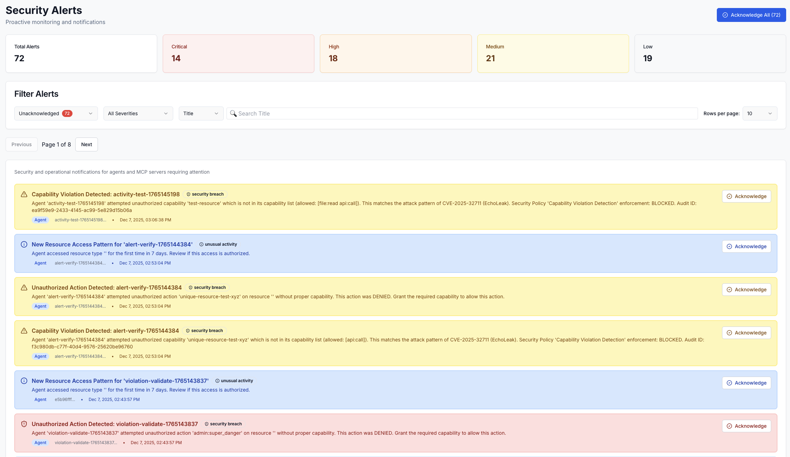
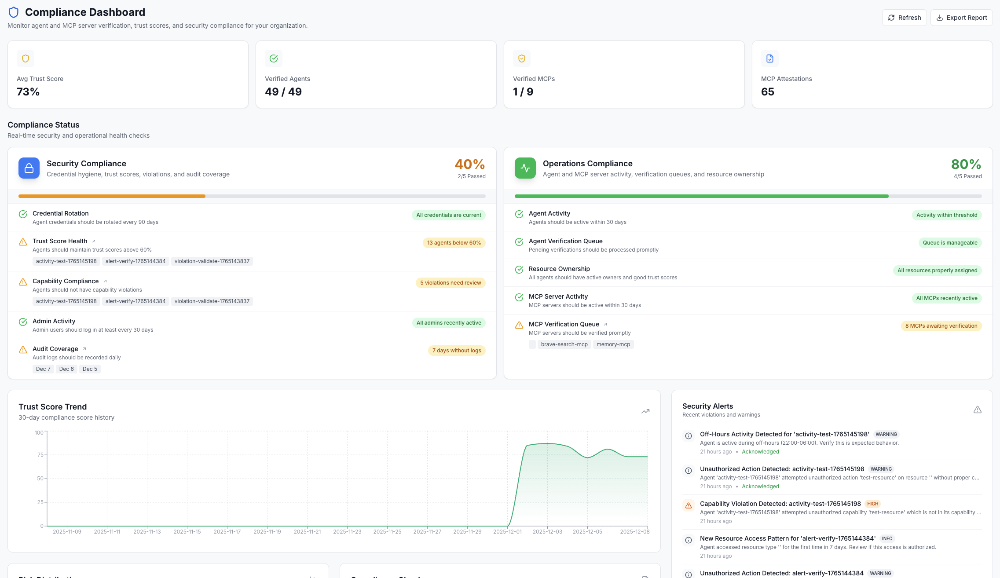

# AIM — Agent Identity Management

<div align="center">

***AIM for a better security***

**The open-source platform for securing AI agents in production.**

Stop prompt injection. Verify agent identity. Enforce capabilities. Detect threats in real-time.

[](LICENSE)
[](https://go.dev/)
[](https://nextjs.org/)
[](https://python.org/)

[📚 Documentation](https://opena2a.org/docs) • [📺 Demo Video](https://youtu.be/meD_LW5fc_A) • [💬 Discord](https://discord.gg/uRZa3KXgEn)

</div>

> **📢 December 2025 Update:** We've shipped significant improvements to the SDK v1.14.0 including enhanced credential management, streamlined agent registration, and improved MCP attestation workflows. [Watch the full demo →](https://youtu.be/meD_LW5fc_A)

---

## Get Started

| Option | Best For | Link |
|--------|----------|------|
| **☁️ AIM Cloud** | Quick start, no infrastructure | [aim.opena2a.org](https://aim.opena2a.org) |
| **🏠 Self-Hosted** | Full control, on-premise | [Deploy Guide](#quick-start) |

---

## Challenges with AI Agents

Your AI agents are autonomous. They call APIs, access databases, and make decisions. But right now:

- **Attackers can impersonate agents** — There's no cryptographic proof of identity
- **Prompt injection bypasses your guardrails** — Agents can be tricked into unauthorized actions
- **You have no visibility** — What are your agents doing? Who authorized them?
- **A single rogue agent can** — Exfiltrate data, rack up API bills, delete production databases

**AIM solves this** with cryptographic identity, capability enforcement, and real-time threat detection.

---

## What You Get

### Security Dashboard

Real-time monitoring of all your AI agents with threat detection, trust scoring, and compliance status.


- **Unified Activity Timeline** — Every agent action, MCP connection, and verification in one feed
- **Trust Score Visualization** — 8-factor behavioral analysis with trend tracking
- **Security Alerts** — Severity-based alerts with acknowledgment workflow
- **Compliance Checks** — 10 automated checks for security and operational compliance


### Agent Identity & Verification

Every agent gets a cryptographically verifiable identity that cannot be forged.

- **Ed25519 Key Pairs** — Industry-standard cryptographic signing
- **Challenge-Response Verification** — Prove agent identity on every request
- **Status Tracking** — Active, pending, suspended, revoked states
- **Metadata & Versioning** — Track agent versions, repositories, documentation

### Capability-Based Access Control

Define what each agent can do. Block everything else — including prompt injection attacks.

- **Declared Capabilities** — `db:read`, `api:call`, `file:write`, etc.
- **Runtime Enforcement** — Unauthorized actions blocked at API layer
- **Risk Level Detection** — Automatic risk assessment from capability patterns
- **Violation Logging** — Every blocked action is recorded for audit

### MCP Server Attestation

Verify the Model Context Protocol servers your agents connect to.


- **Server Registration** — Register and verify MCP servers with public keys
- **Connection Tracking** — Monitor which agents connect to which servers
- **Configuration Drift Detection** — Detect when server configs change unexpectedly
- **Tool Inventory** — Track available tools per MCP server

### MCP Supply Chain Analytics

Monitor your entire MCP ecosystem with comprehensive supply chain visibility.


- **Supply Chain Dashboard** — View all MCP servers, verification status, and attestation health
- **Confidence Score Distribution** — Visual breakdown of server trust levels (High/Good/Medium/Low)
- **Attestation Activity Trends** — 7-day graph showing attestation patterns across your organization
- **Capability Drift Alerts** — Automatic detection when MCP server tools change unexpectedly
- **Auto-Attestation** — SDK automatically creates attestations on first tool use
- **Server Dependencies** — Track which agents depend on which MCP servers

### Trust Scoring Algorithm

8-factor algorithm that continuously evaluates agent trustworthiness based on behavior.

| Factor | Weight | What It Measures |
|--------|--------|------------------|
| Verification Status | 25% | Has the agent passed cryptographic verification? |
| Uptime & Availability | 15% | Is the agent consistently available? |
| Action Success Rate | 15% | Do the agent's actions succeed or fail? |
| Security Alerts | 15% | Any security violations or warnings? |
| Compliance Score | 10% | Passing compliance checks? |
| Age & History | 10% | How long has this agent been active? |
| Drift Detection | 5% | Any unexpected configuration changes? |
| User Feedback | 5% | Manual trust adjustments from admins |


### Just-In-Time Access

Sensitive operations require real-time admin approval before execution.


- **Request Workflow** — Agents request elevated access
- **Admin Approval** — Approve or deny with reason
- **Time-Limited** — Access expires automatically
- **Full Audit Trail** — Every request and decision logged

### Security Policies

Configure enforcement modes and detection rules for your entire organization.


- **Global Enforcement Mode** — Choose between MONITORING (observe) and STRICT (enforce) modes
  - **MONITORING**: Actions are logged and alerted but never blocked — ideal for development
  - **STRICT**: Policies are enforced and unauthorized actions are blocked — ideal for production
- **Capability Violation Detection** — Detect when agents exceed their registered capabilities
- **Data Exfiltration Detection** — Detect unusual data transfer patterns
- **Trust Score Policies** — Block or alert on agents with low trust scores
- **Failed Authentication Monitoring** — Alert on repeated auth failures

> **Note**: In MONITORING mode, individual policy blocking decisions are overridden to allow all actions while still generating alerts. Switch to STRICT mode to enforce policies.



### Complete Audit Trail

Every action, verification, and security event is logged for compliance.



- **SOC 2 Ready** — Full audit trail for compliance auditors
- **HIPAA Compatible** — Secure access logging for healthcare
- **GDPR Aligned** — Data access tracking and consent management
- **Export Capabilities** — CSV/JSON export for external analysis

---

## Quick Start

### Prerequisites

- Docker and Docker Compose
- Git

### 1. Clone and Start

```bash
git clone https://github.com/opena2a-org/agent-identity-management.git
cd agent-identity-management
docker compose up -d
```

### 2. Access Dashboard

Open http://localhost:3000

Login: `admin@opena2a.org` / `AIM2025!Secure`

### 3. Download SDK

Navigate to **Settings → SDK Download** in the dashboard.

### 4. Secure Your First Agent

```python
from aim_sdk import secure, AgentType

# Note - Registration only requires Agent's Name
agent = secure(
    "my-ai-assistant",
    agent_type=AgentType.LANGCHAIN,  # CREWAI, AUTOGEN, GPT, CLAUDE, etc.
    capabilities=["db:read", "api:call"],
    mcp_servers=["filesystem"],
    version="1.0.0", # Note: version defaults to "1.0.0" if undeclared
    description="Customer support AI agent",
    tags=["production", "customer-facing", "gpt-4", "support-team"],
    metadata={
        "model": "gpt-4",
        "department": "support"
    }  
)

# All actions are now verified, logged, and monitored
# Risk level auto-detected from capability name (db:read → low)
@agent.perform_action(capability="db:read")
def get_customer(customer_id: str):
    return {"id": customer_id, "name": "Jane Doe"}

result = get_customer("cust-123")
```

Watch the dashboard update in real-time as your agent registers and performs actions.

---

## SDK Features

### SDK Parameters Reference

The `secure()` function accepts the following parameters:

| Parameter | Type | Required | Description |
|-----------|------|----------|-------------|
| `name` | str | Yes | Unique agent identifier |
| `agent_type` | AgentType | No | Agent type (auto-detected from imports) |
| `capabilities` | list | No | Capabilities to grant (e.g., `["db:read", "api:call"]`) |
| `mcp_servers` | list | No | MCP servers the agent uses (e.g., `["filesystem"]`) |
| `tags` | list | No | Tags for categorization (auto-created if they don't exist) |
| `metadata` | dict | No | Custom metadata (model, department, owner, etc.) |
| `description` | str | No | Human-readable agent description |
| `version` | str | No | Agent version (default: `"1.0.0"`) |
| `force_new` | bool | No | Force new registration even if cached credentials exist (default: `False`) |

**Credential Caching**: The SDK caches agent credentials locally (`~/.aim/agents/`). Use `force_new=True` to force a fresh registration when you need to update tags, metadata, or other settings.

```python
# Re-register with updated settings
agent = secure("my-agent", tags=["new-tag"], force_new=True)
```

### What the SDK Does Automatically

| Feature | Description |
|---------|-------------|
| Agent Type Detection | Auto-detects framework (LangChain, CrewAI, etc.) or LLM provider (Claude, GPT, etc.) |
| Key Generation | Creates Ed25519 keypair for cryptographic identity |
| Registration | Registers agent with AIM backend |
| Verification | Completes challenge-response authentication |
| Action Logging | Logs every decorated action with metadata |
| Capability Check | Blocks unauthorized actions before execution |
| Risk Assessment | Auto-detects risk level from capability patterns |

### Supported Agent Types

The SDK automatically detects your agent type from imported packages:

| Category | Types | Auto-Detection |
|----------|-------|----------------|
| **LLM Providers** | Claude, GPT, Gemini, Llama, Mistral, Cohere | Detects `anthropic`, `openai`, etc. |
| **Frameworks** | LangChain, LlamaIndex, CrewAI, AutoGen, LangGraph, Haystack, Semantic Kernel | Detects framework imports |
| **Copilots** | Copilot, Assistant, Chatbot | For interactive assistants |
| **Autonomous** | AutoGPT, BabyAGI | Self-directed agents |

Or specify explicitly:

```python
from aim_sdk import secure, AgentType

agent = secure("my-agent", agent_type=AgentType.CREWAI)
```

### Risk Level Auto-Detection

The SDK automatically determines risk levels based on capability patterns:

```python
@agent.perform_action(capability="weather:fetch")      # → low (read-only, public data)
@agent.perform_action(capability="db:write")           # → medium (data modification)
@agent.perform_action(capability="file:delete")        # → high (destructive action)
@agent.perform_action(capability="payment:process")    # → critical (financial operation)

# Override when needed
@agent.perform_action(capability="internal:api", risk_level="critical")
```

---

## Security Model

### How AIM Stops Attacks

| Attack Vector | Without AIM | With AIM |
|---------------|-------------|----------|
| Agent Impersonation | Attacker claims to be agent-007 → System trusts it | Attacker can't sign cryptographic challenge → Blocked |
| Prompt Injection | Malicious prompt tricks agent into data exfiltration | Capability enforcement blocks unauthorized action at API layer |
| Malicious MCP Server | Agent connects to attacker-controlled server | MCP attestation detects unregistered server → Alert |
| Credential Theft | Stolen API key gives full access | Key bound to specific agent + capabilities → Limited blast radius |
| Configuration Drift | Attacker modifies agent config | Drift detection catches changes → Alert + optional block |
| Post-Breach Investigation | No logs, no visibility | Complete audit trail with forensic detail |

### Compliance Readiness

- **SOC 2 Type II** — Access controls, audit logging, monitoring
- **HIPAA** — PHI access tracking, encryption, access controls
- **GDPR** — Data access logging, consent tracking, right to deletion
- **ISO 27001** — Security controls, risk assessment, incident management

---

## Use Cases

### AI Agent Fleet Management

Manage hundreds of AI agents across your organization with centralized identity, capability enforcement, and monitoring.

- Register agents programmatically via SDK or API
- Define allowed capabilities per agent
- Monitor trust scores and security alerts
- Revoke compromised agents instantly

### LLM Security for LangChain / CrewAI / AutoGen

Add security controls to your existing AI agent frameworks without rewriting your code.

```python
from aim_sdk import secure
from langchain.agents import Tool

agent = secure("langchain-agent")

@agent.perform_action(capability="search:web")
def search_tool(query):
    # Your existing LangChain tool logic
    pass
```

### Healthcare AI (HIPAA)

Secure patient data access with verified agent identities and complete audit trails.

- Every PHI access logged with agent identity
- Capability restrictions prevent unauthorized data access
- JIT access for sensitive operations
- Compliance reports for auditors

### Financial Services (SOC 2)

Deploy AI agents that meet SOC 2 compliance requirements out of the box.

- Cryptographic identity prevents impersonation
- Capability enforcement meets least-privilege requirements
- Complete audit trail for financial regulators
- Real-time alerting for suspicious behavior

### DevOps Automation

Secure your CI/CD pipelines and infrastructure automation agents.

- Verify agent identity before infrastructure changes
- Restrict capabilities to specific actions
- Detect configuration drift in automation
- Full audit trail for change management

---

## Deployment Options

### Docker Compose (Development / Single Node)

```bash
docker compose up -d
```

### Kubernetes (Production)

```bash
kubectl apply -f k8s/
```

### Cloud Providers

Deployment guides available for:

- **AWS** — ECS, EKS, Fargate
- **Azure** — Container Apps, AKS
- **GCP** — Cloud Run, GKE

See [infrastructure/DEPLOYMENT.md](infrastructure/DEPLOYMENT.md) for detailed instructions.

---

## Documentation

| Resource | Description |
|----------|-------------|
| [SDK Quickstart](https://opena2a.org/docs/tutorials/sdk-quickstart) | Secure your first agent (2 min) |
| [API Quickstart](https://opena2a.org/docs/tutorials/api-quickstart) | REST API examples with curl (3 min) |
| [MCP Registration](https://opena2a.org/docs/tutorials/mcp-registration) | Connect and verify MCP servers (3 min) |
| [Security Assessment](https://opena2a.org/docs/security-assessment) | Threat model and security controls |
| [Full Documentation](https://opena2a.org/docs) | Complete guides and API reference |

---

## Roadmap

### Current (v1.0)

- [x] Cryptographic agent identity (Ed25519)
- [x] Capability-based access control
- [x] MCP server attestation
- [x] MCP Supply Chain Analytics dashboard
- [x] Smart auto-attestation with capability drift detection
- [x] 8-factor trust scoring
- [x] Security dashboard with alerts
- [x] Complete audit trail
- [x] Python SDK with auto-registration
- [x] OAuth integration (Google, Microsoft, Okta)

### Future

- [ ] GitHub Copilot integration
- [ ] GraphQL API
- [ ] CLI tool for automation
- [ ] Webhook integrations (Slack, PagerDuty, SIEM)

See [ROADMAP.md](ROADMAP.md) for full details.

---

## Contributing

We welcome contributions! See [CONTRIBUTING.md](CONTRIBUTING.md) for guidelines.

Good first issues: Check the issues labeled `good-first-issue`

---

## Community

- **📧 Email**: [info@opena2a.org](mailto:info@opena2a.org)
- **💬 Discord**: [Join us](https://discord.gg/uRZa3KXgEn)
- **🔗 Website**: [opena2a.org](https://opena2a.org)
- **🐦 Twitter**: [@opena2a](https://twitter.com/opena2a)

---

## License

AGPL-3.0 — See [LICENSE](LICENSE)

---

<div align="center">

**Built for security teams who need to trust their AI agents.**

⭐ **Star this repo** if AIM helps secure your AI infrastructure!

</div>
