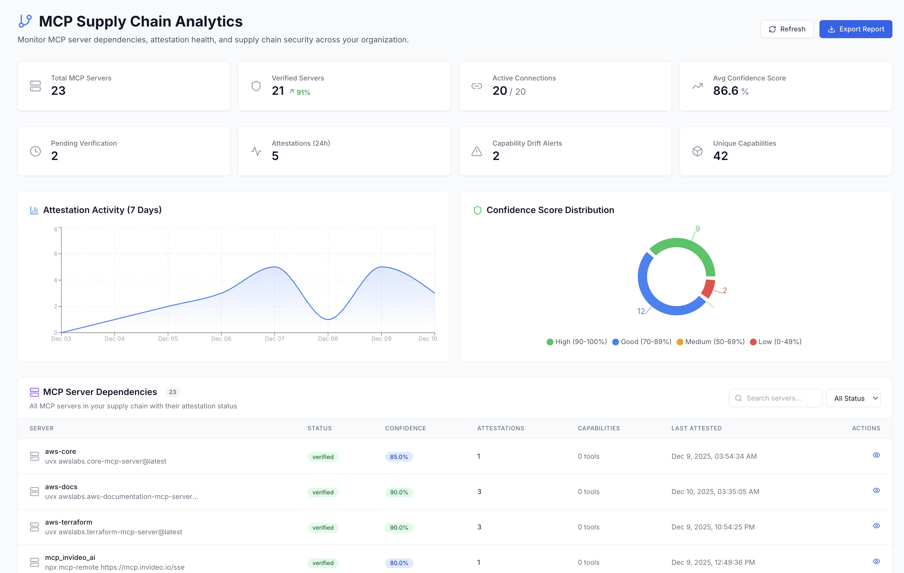

# 🔌 MCP Integration - Secure Model Context Protocol Servers

Register and attest your MCP servers with AIM for cryptographic verification, supply chain security, and trust scoring.

## What You'll Build

An MCP integration that:
- ✅ Registers MCP servers with cryptographic verification
- ✅ Attests to MCP server authenticity with Ed25519 signatures
- ✅ **Auto-attests** on first tool use (zero friction)
- ✅ Tracks agent-MCP connections for audit trails
- ✅ Monitors MCP server trust scores and confidence
- ✅ Detects drift when agents connect to unregistered servers
- ✅ **Supply Chain Analytics** dashboard for full ecosystem visibility

**Integration Time**: 5 minutes
**Use Case**: Claude Desktop, MCP servers, AI assistants

---

## What is MCP?

**Model Context Protocol (MCP)** is an open protocol that lets AI assistants (like Claude Desktop) securely connect to external data sources and tools.

**Examples of MCP Servers**:
- **Database MCP**: Lets Claude query your PostgreSQL/MySQL databases
- **Filesystem MCP**: Gives Claude access to local files
- **GitHub MCP**: Connects Claude to your GitHub repositories
- **Slack MCP**: Allows Claude to send messages, read channels

**The Problem**: How do you know an MCP server is legitimate and hasn't been compromised?

**AIM's Solution**: Cryptographic verification + continuous monitoring + attestation

---

## Prerequisites

1. ✅ AIM platform running ([Quick Start Guide](../quick-start.md))
2. ✅ AIM SDK downloaded from dashboard
3. ✅ Python 3.8+ with dependencies: `pip install keyring PyNaCl requests cryptography`

---

## Available Functions

The MCP integration provides these functions:

### Auto-Detection (from `aim_sdk`)

| Function | Description |
|----------|-------------|
| `auto_detect_mcps()` | Auto-detect MCP servers from Claude Desktop config and imports |
| `MCPDetector` | Class for advanced MCP detection with multiple methods |
| `track_mcp_call()` | Track runtime MCP tool calls for discovery |

### Registration & Attestation (from `aim_sdk.integrations.mcp`)

| Function | Description |
|----------|-------------|
| `register_mcp_server()` | Register a new MCP server with AIM |
| `list_mcp_servers()` | List all registered MCP servers |
| `attest_mcp_server()` | Cryptographically attest to an MCP server |
| `use_mcp_tool()` | Record MCP tool usage for audit trail |
| `get_attestation_challenge()` | Get a challenge nonce for attestation |

---

## Auto-Detection (Easiest)

AIM can automatically detect MCP servers from your Claude Desktop configuration and Python imports.

### Quick Detection

```python
from aim_sdk import auto_detect_mcps

# Automatically detect all MCP servers
detections = auto_detect_mcps()

print(f"Found {len(detections)} MCP servers:")
for detection in detections:
    print(f"  - {detection['mcpServer']} (method: {detection['detectionMethod']})")
```

**Detection Methods**:
- `claude_config` - Reads `~/.claude/claude_desktop_config.json`
- `sdk_import` - Scans Python imports for MCP packages
- `sdk_runtime` - Tracks MCP calls made at runtime

### Advanced Detection with MCPDetector

```python
from aim_sdk import MCPDetector

detector = MCPDetector()

# Detect from Claude Desktop config only
config_detections = detector.detect_from_claude_config()

# Detect from Python imports only
import_detections = detector.detect_from_imports()

# Detect from all sources including runtime tracking
all_detections = detector.detect_all_with_runtime()

for detection in all_detections:
    print(f"{detection['mcpServer']}: {detection['confidence']}% confidence")
```

### Runtime Tracking

Track MCP tool calls as they happen for automatic discovery:

```python
from aim_sdk import track_mcp_call

# Before calling an MCP tool, track it
track_mcp_call("filesystem", "read_file")

# Your MCP call here
result = mcp_client.call_tool("filesystem", "read_file", {"path": "/tmp/file.txt"})

# Later, get all tracked calls
from aim_sdk import MCPDetector
runtime_detections = MCPDetector.get_runtime_detections()
```

---

## Registering an MCP Server

Register an MCP server with AIM to enable cryptographic verification and trust scoring.

```python
from aim_sdk import secure
from aim_sdk.integrations.mcp import register_mcp_server

# Initialize AIM agent
aim_agent = secure("my-agent")

# Register an MCP server
result = register_mcp_server(
    aim_client=aim_agent,
    server_name="weather-mcp",
    server_url="http://localhost:3001",
    public_key="ed25519_base64_encoded_public_key",
    capabilities=["weather:current", "weather:forecast"],
    description="Weather data provider MCP server"
)

print(f"✅ Registered MCP server: {result['id']}")
print(f"   Status: {result['status']}")
```

### Parameters

| Parameter | Type | Required | Description |
|-----------|------|----------|-------------|
| `aim_client` | AIMClient | Yes | AIM client instance |
| `server_name` | str | Yes | Name of the MCP server |
| `server_url` | str | Yes | Base URL of the MCP server |
| `public_key` | str | Yes | Ed25519 public key (base64 encoded) |
| `capabilities` | List[str] | Yes | List of server capabilities |
| `description` | str | No | Description of the server |
| `version` | str | No | Server version (default: "1.0.0") |

---

## Registration Verification and Pre-Connection Scans

What AIM does at MCP-server registration is a process check, not a vulnerability scan against the server itself.

### Registration paths

| Registered via | `status` | `is_verified` | `trust_score` | `verification_method` |
|---|---|---|---|---|
| SDK (agent-authenticated) | `verified` | `true` | `75` | `sdk_registration` |
| Manual / dashboard | `pending` | `false` | `0` | `manual` (admin must click Verify) |

The SDK-registration auto-verify is set in `mcp_service.go:208-239` and is not the result of an external scan — it is a trust assumption that the calling agent has already proved its own identity through OAuth. Manual registrations stay pending until an admin acts on them in the dashboard.

### What AIM does NOT do at registration time

- It does NOT invoke HackMyAgent against the MCP server URL. There are zero `hackmyagent` / `HackMyAgent` references anywhere under `apps/backend/`.
- It does NOT pull the MCP server's own SOUL.md / agent-card.json / capabilities.json for static review.
- It does NOT block subsequent calls based on `mcp_servers.is_verified = false`. The FGA engine (`apps/backend/internal/application/fga_engine.go`) has zero references to MCP-side `is_verified` / `isVerified` / `IsVerified` — authorization decisions read the AGENT's `agent_security_contexts.scan_verdict`, not the MCP's verification status.
- It does NOT populate a `scanSummary` field on the agent or the MCP. `scanSummary` exists in exactly one place — `apps/backend/internal/domain/registry_contribution.go:11`, where it is part of the payload AIM publishes UPSTREAM to the public Registry via `registry_bridge_service.go`. It is registry export telemetry, not a per-call gate.

### What "pre-connection" actually means in current AIM

The closest current AIM gets to a pre-connection check is the cryptographic attestation flow described in [How Attestation Works](#how-attestation-works) — the agent proves it currently holds a private key that matches the MCP server's registered public key. That confirms the MCP is the same MCP, but it does not confirm anything about the MCP's own dependencies, vulnerabilities, or configuration.

If your operational requirement is "no agent talks to an MCP that has not been scanned by HackMyAgent within the last N days," that needs to be a separate primitive that:

1. Calls into HackMyAgent against the MCP's deployable surface (URL, repo, or container image).
2. Writes the result to a new column (`mcp_servers.last_scan_verdict`, or a new `mcp_scan_results` table).
3. Gates `agents.talks_to` or the FGA `verify_capability` path on that field.

None of these exist today. Building them is a `[CHIEF-CA]` decision because it requires committing to a specific HMA-AIM integration surface and a policy for what to do when a scan finds new CVEs (alert? auto-degrade trust? auto-revoke verification?).

Until then, the honest framing for the registration story is: **AIM verifies the agent that registers an MCP, not the MCP itself.**

---

## Listing MCP Servers

List all MCP servers registered with AIM for your organization.

```python
from aim_sdk import secure
from aim_sdk.integrations.mcp import list_mcp_servers

aim_agent = secure("my-agent")

# List all registered MCP servers
servers = list_mcp_servers(aim_client=aim_agent, limit=20)

print(f"Found {len(servers)} MCP servers:")
for server in servers:
    print(f"  - {server['name']}: {server['status']} (trust: {server.get('trustScore', 'N/A')})")
```

---

## Attesting an MCP Server

Attestation cryptographically verifies an MCP server's identity and increases its trust score.

```python
from aim_sdk import secure
from aim_sdk.integrations.mcp import attest_mcp_server, list_mcp_servers

aim_agent = secure("my-agent")

# Get the server to attest
servers = list_mcp_servers(aim_client=aim_agent)
server = servers[0]

# Submit attestation
result = attest_mcp_server(
    aim_client=aim_agent,
    server_id=server['id'],
    mcp_url=server['url'],
    mcp_name=server['name'],
    capabilities_found=["weather:current", "weather:forecast"],
    connection_successful=True,
    health_check_passed=True,
    connection_latency_ms=45.0
)

print(f"✅ Attestation successful!")
print(f"   New confidence score: {result.get('mcp_confidence_score', 'N/A')}%")
```

### How Attestation Works

1. **Request Challenge**: AIM generates a unique nonce
2. **Sign Attestation**: Agent signs attestation data including the nonce with Ed25519 key
3. **Verify Signature**: AIM verifies the signature using the agent's public key
4. **Update Trust**: MCP server's confidence score increases

This proves the agent holds the private key at attestation time and prevents replay attacks.

---

## Recording MCP Tool Usage

Track when agents use MCP server tools for audit trails and drift detection.

```python
from aim_sdk import secure
from aim_sdk.integrations.mcp import use_mcp_tool

aim_agent = secure("my-agent")

# Record MCP tool usage
result = use_mcp_tool(
    aim_client=aim_agent,
    server_id="server-uuid-here",
    tool_name="read_file",
    mcp_url="http://localhost:3001",
    mcp_name="filesystem-mcp"
)

print(f"✅ Tool usage recorded: {result.get('connection_id')}")
```

---

## Complete Example

Here's a complete example showing the full MCP workflow:

```python
"""
MCP Integration Example - Full Workflow
"""

from aim_sdk import secure
from aim_sdk.integrations.mcp import (
    register_mcp_server,
    list_mcp_servers,
    attest_mcp_server,
    use_mcp_tool
)
import base64
import os

# Initialize AIM agent
aim_agent = secure("mcp-demo-agent")

# Generate a demo Ed25519 public key (in production, use real key from MCP server)
demo_public_key = base64.b64encode(b"demo-public-key-32-bytes-long!!").decode()

# Step 1: Register MCP server
print("📝 Registering MCP server...")
server = register_mcp_server(
    aim_client=aim_agent,
    server_name="demo-mcp",
    server_url="http://localhost:3001",
    public_key=demo_public_key,
    capabilities=["read_file", "write_file", "search"],
    description="Demo MCP server for file operations"
)
print(f"✅ Registered: {server['id']}")

# Step 2: List all servers
print("\n📋 Listing MCP servers...")
servers = list_mcp_servers(aim_client=aim_agent)
for s in servers:
    print(f"  - {s['name']}: {s['status']}")

# Step 3: Attest the server
print("\n🔐 Attesting MCP server...")
attestation = attest_mcp_server(
    aim_client=aim_agent,
    server_id=server['id'],
    mcp_url="http://localhost:3001",
    mcp_name="demo-mcp",
    capabilities_found=["read_file", "write_file", "search"],
    connection_successful=True,
    health_check_passed=True,
    connection_latency_ms=35.0
)
print(f"✅ Attestation complete! Confidence: {attestation.get('mcp_confidence_score', 'N/A')}%")

# Step 4: Record tool usage
print("\n📊 Recording tool usage...")
usage = use_mcp_tool(
    aim_client=aim_agent,
    server_id=server['id'],
    tool_name="read_file",
    mcp_url="http://localhost:3001",
    mcp_name="demo-mcp"
)
print(f"✅ Tool usage recorded: {usage.get('connection_id', 'OK')}")

print("\n🎉 MCP integration complete!")
print("View in dashboard: http://localhost:3000/dashboard/mcp")
```

---

## Dashboard Integration

After registering and attesting MCP servers, view them in the AIM dashboard:

**Dashboard URL**: http://localhost:3000/dashboard/mcp

The dashboard shows:
- All registered MCP servers
- Trust/confidence scores
- Connected agents
- Attestation history
- Tool usage audit trail

---

## Supply Chain Analytics

Monitor your entire MCP ecosystem from a single dashboard:

**Dashboard URL**: http://localhost:3000/dashboard/mcp/supply-chain



### Key Metrics

| Metric | Description |
|--------|-------------|
| **Total MCP Servers** | All servers registered in your organization |
| **Verified Servers** | Servers that have passed attestation verification |
| **Pending Verification** | Servers awaiting first attestation |
| **Avg Confidence Score** | Average trust score across all servers |
| **Attestation Activity** | 7-day trend of attestation events |
| **Capability Drift Alerts** | Servers with changed tool capabilities |

### Confidence Score Distribution

Servers are categorized by confidence level:
- 🟢 **High (90-100%)** - Multiple attestations, stable capabilities
- 🔵 **Good (70-89%)** - Verified, regular attestations
- 🟡 **Medium (50-69%)** - Few attestations, needs more verification
- 🔴 **Low (0-49%)** - Unverified or suspicious activity

### Server Dependencies Table

View all MCP servers with:
- Verification status (verified/pending)
- Confidence score
- Number of attestations
- Available capabilities (tools)
- Last attestation timestamp

---

## Attestation Lifecycle and Expiry

The attestation lifecycle has three timeframes, none of which trigger an automatic vulnerability re-scan. Re-attestation is **client-driven on use**, not server-cron-driven.

### Server-side TTLs

| Object | TTL | Behavior at expiry |
|---|---|---|
| Attestation challenge nonce | 5 minutes | Rejected as `attestation expired` to prevent replay attacks (`mcp_attestation_service.go:483`) |
| SDK MCP attestation record | 30 days from `verified_at` | Record stays in `mcp_attestations` for history; `is_valid` returns false; the server does NOT automatically queue a re-scan (`mcp_attestation_service.go:504`) |
| Manual MCP attestation record | 90 days from `verified_at` | Same — history retained, `is_valid` false, no auto re-scan (`mcp_attestation_service.go:1247`) |

No background goroutine in `cmd/server/main.go` walks `mcp_attestations` to mark expired rows or to invoke a re-scan against HackMyAgent. The only periodic cleanup job (`startExpirationCleanupJob`, runs every 5 minutes) operates on `verification_events`, not MCP attestations.

### Client-side refresh interval

The SDK's `AttestationCache` (`sdk/python/aim_sdk/attestation_cache.py:48`) uses `DEFAULT_TTL_HOURS = 24`. On every MCP tool invocation through `use_mcp_tool()`, the SDK checks the cache and re-attests if the cached attestation is older than 24 hours. This is what makes an ACTIVELY USED MCP server effectively re-attested every day; an MCP server that is registered but not invoked sits at its last attestation until the server-side TTL above lapses.

### The 7-day window in the confidence score

A 7-day window does appear in the attestation code, but it is a **recency factor in the confidence-score calculation**, not an expiry trigger. The "recency" component awards points based on the fraction of an MCP server's attestations that fall within the last 7 days (`mcp_attestation_service.go:617`). A server whose most recent attestations are all older than 7 days simply scores lower on the recency axis; it is not invalidated, and no scan is queued.

### Vulnerability discovery is independent of the attestation lifecycle

The attestation flow asserts that an agent currently holds a private key matching an MCP server's public key — it does not, by itself, scan the MCP server for new CVEs in its dependencies. CVE discovery against an MCP server is the job of HackMyAgent / the supply-chain scanner; the attestation lifecycle does not currently invoke it. Treat "re-attestation" and "re-scan" as separate primitives, not as the same cycle.

If your operational requirement is "every MCP server gets a fresh vulnerability scan every N days," that needs to be a separate scheduled job that calls into HackMyAgent — it is not implied by the attestation TTLs above.

---

## Auto-Attestation

The SDK can automatically create attestations when you use MCP tools, requiring zero manual intervention:

```python
from aim_sdk import secure
from aim_sdk.integrations.mcp import use_mcp_tool

aim_agent = secure("my-agent")

# Auto-attestation happens automatically on first tool use
result = use_mcp_tool(
    aim_client=aim_agent,
    server_id="server-uuid",
    tool_name="read_file",
    mcp_url="http://localhost:3001",
    mcp_name="filesystem",
    auto_attest=True  # Default: automatically creates attestation
)
```

### How Auto-Attestation Works

1. **First Tool Use**: When an agent uses an MCP tool for the first time
2. **Automatic Discovery**: SDK discovers server capabilities
3. **Create Attestation**: Attestation created with discovered tools
4. **Update Confidence**: Server confidence score increases
5. **Database Sync**: MCP server verification status automatically updates

### Attestation Triggers

Auto-attestation occurs when:
- First use of an MCP server by an agent
- First use of a NEW tool on a known server
- 24+ hours since last attestation (configurable)
- Capability drift detected (tools added/removed)

---

## Drift Detection

AIM automatically detects when agents connect to unregistered MCP servers:

1. **Agent connects to unknown MCP** → Drift alert created
2. **Dashboard notification** → Admin reviews the alert
3. **Register or block** → Admin decides to trust or deny

This prevents shadow IT and ensures all MCP connections are tracked.

---

## Troubleshooting

### Issue: "server_name cannot be empty"

Ensure you provide a valid server name:
```python
register_mcp_server(
    aim_client=aim_agent,
    server_name="my-mcp",  # Must be non-empty
    ...
)
```

### Issue: "public_key must be a valid Ed25519 public key"

The public key must be at least 32 characters. Use base64-encoded Ed25519 key:
```python
import base64
public_key = base64.b64encode(your_ed25519_public_key_bytes).decode()
```

### Issue: "Authentication failed"

Ensure your AIM agent is properly initialized:
```python
aim_agent = secure("my-agent")  # This handles auth automatically
```

---

## Next Steps

- [CrewAI Integration →](./crewai.md) - Multi-agent teams
- [LangChain Integration →](./langchain.md) - LangChain agents
- [SDK Documentation](../sdk/python.md) - Complete SDK reference

---

<div align="center">

**MCP Integration Complete** 🎉

[🏠 Back to Home](../../README.md) • [📚 All Integrations](./index.md)

</div>
